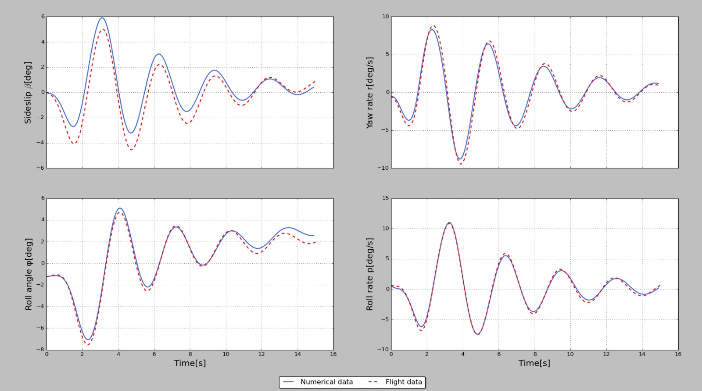

Numerical investigation of the eigenmotions of TU Delft's Cessna Citation II aircraft.

Includes:
  - State space formulation for linearized longitudinal and lateral dynamics.
  - Validation against real-world flight data.
  - Optimized model fit.
  

